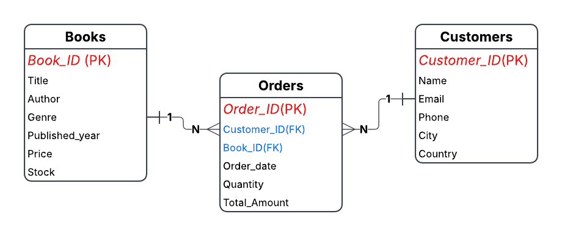

# Online Bookstore SQL Analysis

## Executive Summary

This project analyzes an online bookstore's **books, customers, and order data** using **PostgreSQL**. The objective is to uncover meaningful insights related to **sales performance, customer purchasing behavior, revenue generation, and inventory management**.

---

## Key Performance Indicators

| KPI | Value |
|---|---:|
| Total Books | 500 |
| Total Customers | 500 |
| Total Orders | 500 |
| Total Books Sold | 2,697 |
| Total Revenue | $75,628.66 |
| Average Order Value | $151.26 |
| Average Books per Order | 5.39 |

---

## Key Findings

- **Romance** generated the highest revenue among the available book genres.
- **"Realigned multi-tasking installation"** was the best-selling book based on total quantity sold.
- **Kim Turner** was the highest-spending customer.
- **45.28% of purchasing customers were repeat customers**, indicating a significant level of customer retention.
- **"Expanded local infrastructure" (Mystery)** showed potential inventory risk due to the combination of demand and remaining stock levels.

---

## Business Recommendations

- **Prioritize replenishment:** Closely monitor high-demand, low-stock books to reduce the risk of stockouts.
- **Focus on high-performing genres:** Allocate promotional efforts toward genres generating higher sales and revenue.
- **Improve customer retention:** Develop targeted offers and loyalty initiatives for one-time customers to encourage repeat purchases.
- **Optimize slow-moving inventory:** Review low-demand books for possible pricing adjustments, promotions, or bundled offers.

---

## Project Objective

The project uses SQL to answer business-oriented questions across three core areas:

1. **Sales & Revenue Analysis**
2. **Customer Behavior Analysis**
3. **Inventory & Product Analysis**

The analysis progresses from **basic SQL queries to advanced analytical queries**, covering filtering, aggregation, joins, grouping, `HAVING`, sorting, subqueries, and inventory calculations.

---

## Database Structure

The database consists of three interconnected tables:

- **Books** – Contains book details, pricing, genre, publication year, and stock information.
- **Customers** – Contains customer demographic and contact information.
- **Orders** – Contains transaction-level information including order date, quantity, and total amount.

### Entity Relationship Diagram

---

## Tools & Technologies

- **PostgreSQL**
- **SQL**
- **pgAdmin 4**
- **Git & GitHub**

## Project Highlights

The project goes beyond simply writing SQL queries. The analysis translates database-level results into **business insights and actionable recommendations**, demonstrating how SQL can be used for practical business decision-making.

---
